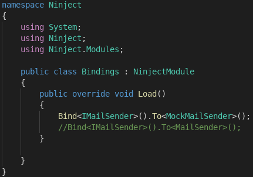
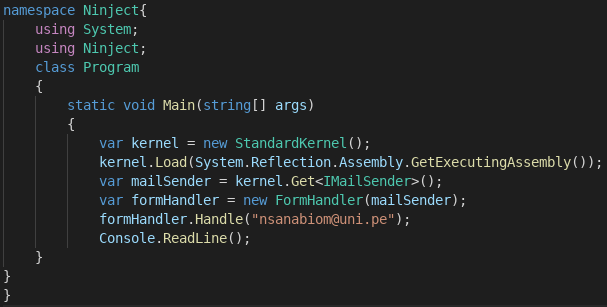
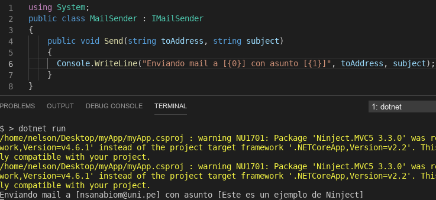

# Aplicativo usando el IoC "Ninject"

Supongamos que está creando una aplicación web que enviará correos electrónicos a los visitantes que hayan ingresado un formulario. En el código orientado a objetos, es importante separar las responsabilidades. Así que probablemente terminará con una clase que maneja la entrada del formulario **FormHandler** y una clase que es responsable de enviar los correos electrónicos **MailSender**.

Me atendré a la inyección de dependencia más fácil (y la más utilizada), llamada inyección de constructor. Lo bueno de Ninject es que no tiene que cambiar MailSender, IMailSender o FormHandler en absoluto. Se crear una clase **"Binding.cs"** para configurar las dependencias en tiempo de ejecución:

El nombre de la clase puede ser lo que quieras; Ninject lo encontrará siempre que herede de NinjectModule. Su código de llamada **Program.cs** tiene que usar Ninject para determinar qué implementación concreta usar:

Cuando ejecute este código, la consola dirá "Mocking mail a [{0}] con asunto [{1}]", que también es lo que esperábamos. ¡La inyección de dependencia está funcionando! 
- El código está creando un **kernel** de Ninject que resuelve toda nuestra cadena de dependencias. 
- Le decimos a Ninject que cargue los enlaces del ensamblaje en ejecución con el método **Load**. 
- En este caso, su clase de enlaces debe vivir en uno de los ensamblajes incluidos en el proyecto *myApp* en ejecución. 
- Esto significa que su clase de enlaces generalmente vivirá en su sitio web, servicio web, servicio de Windows, aplicación de consola o proyecto de prueba de unidad, ya que están en la parte superior de la cadena de código de ejecución. 
- Para cada cadena / contexto (sitio web, consola) puede crear una clase de enlaces diferente con diferentes configuraciones teniendo la misma terminología que las clases _MailSender_ y _MockMailSender_.
- Por ejemplo, puede cambiar la clase de enlaces para usar el _MailSender_ dondequiera que se use _IMailSender_: 
    - la consola dirá "Enviando mail a [{0}] con asunto [{1}]"

