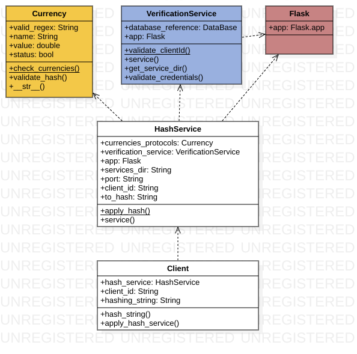
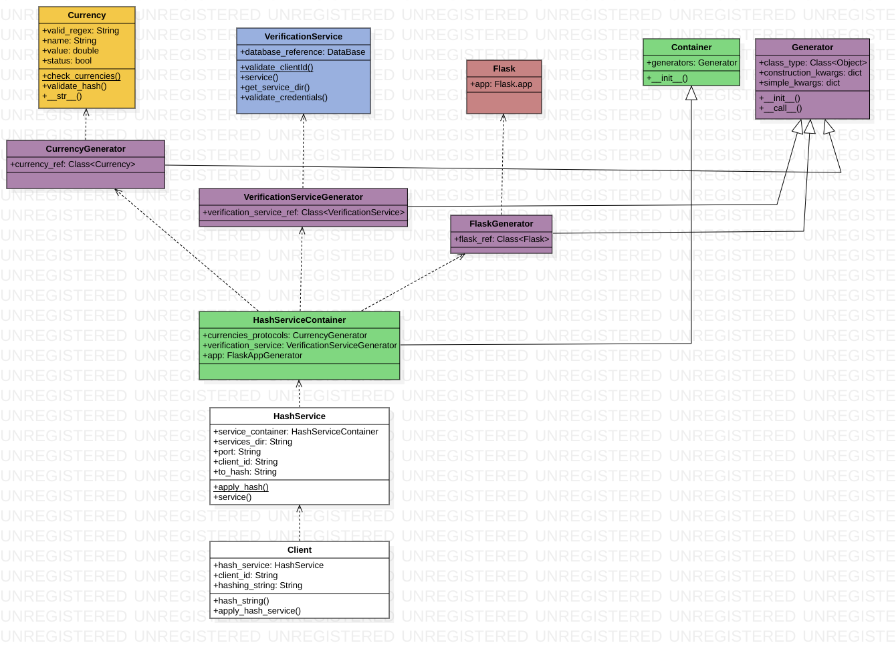

# SIMPLE INJECTOR
## (Mini-libreria de DI para python)

## Documentación ilustrativa

Integrantes: 
- Luis Vasquez
- Nelson Sanabio
- Miguel Oviedo

___

___

## Generator
Clase de producción de dependencias individuales.
* __init__: Método constructor que especifica la clase que generará el _generator_ y los argumentos que utilizará.
    
    * self.construction_kwargs: Diccionario de argumentos de dependencias
    
    * self.simple_kwargs: Diccionario de argumentos planos (IoC-friendly)

* __call__: Método de fabricación de instancias. Construirá primero un diccionario de argumentos a partir de las tres (3) posibles fuentes de dependencias especificadas durante la vida del __generator__. Finalmente, retorna la instancia de la clase especificada durante la contrucción, usando los argumentos almacenados en el diccionar previamente construido.


```python
class Generator:
    def __init__(self, class_reference, **kwargs):
        self.class_type = class_reference
        self.construction_kwargs = {}
        self.simple_kwargs = {}
        for arg, constructor in kwargs.items():
            if isinstance(constructor, Generator):
                self.construction_kwargs[arg] = constructor
            else:
                self.simple_kwargs[arg] = constructor

    def __call__(self, **specific_kwargs):
        final_args_dict = {}

        for arg, generator in self.construction_kwargs.items():
            final_args_dict[arg] = generator()

        for arg, value in self.simple_kwargs.items():
            final_args_dict[arg] = value

        for arg, value in specific_kwargs.items():
            final_args_dict[arg] = value

        return self.class_type(**final_args_dict)
```

## Container
Clase de agrupación y administración de generadores.
* __init__: Método constructor que especifica los generadores con los que se trabajará.
    
    * self.generators: Lista de _< Generator >_'s


```python
class Container:
	def __init__(self):
		self.generators = []
	
	def __str__(self):
		dependencies = [g.class_type for g in self.generators]
		unique_generators = list(set(dependencies))
		dependencies_count = {unique_dependency: dependencies.count(unique_dependency)
				for unique_dependency in unique_generators}
		
		return str(dependencies_count)

	def add_generators(self, generators):
		self.generators += generators
```

___
## Ejemplo
Supongamos que deseamos administrar la generación de autómoviles a partir de la dependencia de sus autopartes:


```python
class Engine:
    def __init__(self, brand):
        self.brand = brand

    def __str__(self):
        return str(self.__dict__)

class Car:
    def __init__(self, engine, car_id):
        self.engine = engine
        self.id = car_id

    def __str__(self):
        return str(self.__dict__)
```


```python
engine_generator_1 = Generator(Engine)
print("Generator:", engine_generator_1)

engine_1 = engine_generator_1(brand='Ford')
print("Generates:", type(engine_1))
print("Object args:", engine_1)
```

    Generator: <__main__.Generator object at 0x7f8ab41cf320>
    Generates: <class '__main__.Engine'>
    Object args: {'brand': 'Ford'}


```python
engine_generator_2 = Generator(Engine, brand='Renault')
print("Generator:", engine_generator_2)

engine_2 = engine_generator_2()
print("Generates:", type(engine_2))
print("Object args:", engine_2)
```

    Generator: <__main__.Generator object at 0x7f8ab41cf470>
    Generates: <class '__main__.Engine'>
    Object args: {'brand': 'Renault'}


```python
car_generator_1 = Generator(Car, engine=engine_generator_1)
print("Generator:", car_generator_1)

car_1 = car_generator_1(car_id='BAD_CAR_123')
```

    Generator: <__main__.Generator object at 0x7f8ab41cf6a0>


    ---------------------------------------------------------------------------

    TypeError                                 Traceback (most recent call last)

    <ipython-input-6-fc8f07702a09> in <module>
          2 print("Generator:", car_generator_1)
          3 
    ----> 4 car_1 = car_generator_1(car_id='BAD_CAR_123')
    

    <ipython-input-1-ac3e1cbecf0c> in __call__(self, **specific_kwargs)
         14 
         15         for arg, generator in self.construction_kwargs.items():
    ---> 16             final_args_dict[arg] = generator()
         17 
         18         for arg, value in self.simple_kwargs.items():


    <ipython-input-1-ac3e1cbecf0c> in __call__(self, **specific_kwargs)
         22             final_args_dict[arg] = value
         23 
    ---> 24         return self.class_type(**final_args_dict)
    

    TypeError: __init__() missing 1 required positional argument: 'brand'


```python
car_generator_2 = Generator(Car, engine=engine_generator_2)
print("Generator:", car_generator_2)

car_2 = car_generator_2(car_id='GOOD_CAR_123')
print("Generates:", type(car_2))
print("Object args:", car_2)
print("Engine in car:", car_2.engine)
```

    Generator: <__main__.Generator object at 0x7f8ab41502e8>
    Generates: <class '__main__.Car'>
    Object args: {'engine': <__main__.Engine object at 0x7f8ab4150358>, 'id': 'GOOD_CAR_123'}
    Engine in car: {'brand': 'Renault'}


# **Aplicación & Demo**

## Estructura inicial



## Distribución aplicando DI


